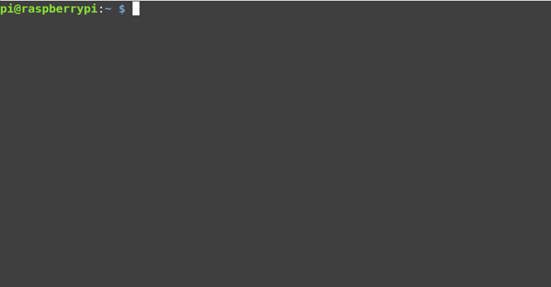
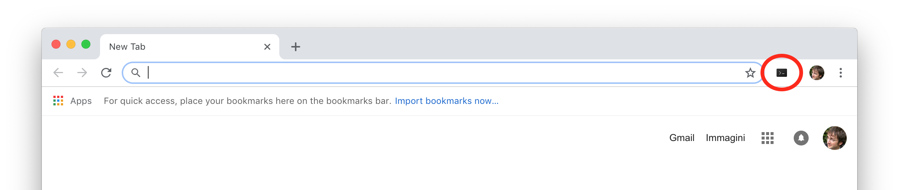
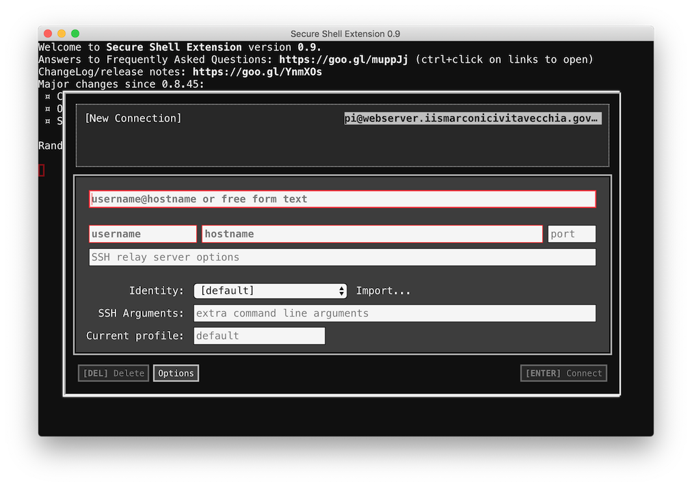

# Raspberry PI

Nello studio del computer abbiamo la fortuna di poter utilizzare i nostri dispositivi per poter verificare in prima persona
gli argomenti. Per semplicità, per questo corso ho scelto di usare la Raspberry PI, una _single-board computer_ dal prezzo accessibile (circa 40€) e dalle prestazioni adatte alla maggior parte degli usi domestici. L'ultimo modell ad oggi (ottobre 2018) è la Raspberry Pi 3 B+.

<p align="center">

</p>

> Raspberry Pi è stata sviluppata nel Regno Unito dalla Raspberry Pi Foundation. La presentazione al pubblico è avvenuta il 29 febbraio 2012. E' attualmente la single-board computer più diffusa sul mercato, è molto facile trovare progetti di tutti i tipi che ne fanno uso.  

Single-board computer significa che tutte le componenti del computer sono sulla stessa scheda. Come dicevamo nel capitolo precedente, a noi interessano particolarmente _processore_ e _memoria_.

Analizziamo la Raspberry: per sapere a cosa corrispondono i vari componenti, possiamo leggere il codice stampato sopra ad ognuno di essi e fare una ricerca su Internet. Dopo una breve ricerca possiamo trovare che il processore è quello cerchiato nell'immagine qui sotto, con la scritta "Broadcom".
<p align="center">

</p>

Dov'è la RAM? Per trovarla dobbiamo girare la scheda e guardare sul retro. Il chip è quello grande con scritto "Elpida".
<p align="center">

</p>

## Accedere al terminale
### Raspberry PI personale
Se avete a disposizione a casa una Raspberry, potete usarla per questo corso, è la scelta raccomandata.

Se non l'avete già fatto, scaricate e installate il sistema operativo seguendo la [guida ufficiale](https://www.raspberrypi.org/downloads/raspbian/). Avrete bisogno di una scheda SDCard; vi consiglio una scheda da 8, 16 o 32 GB.

Una volta accesa, aprite un terminale premendo sull'icona con lo schermino nero nella barra in alto, a sinistra. Vi comparirà una schermata simile a quella qui sotto.
<p align="center">

</p>

### Raspberry PI remota
Se non avete una Raspberry, potete usare quella della scuola collegandovi via SSH. Potete collegarvi da desktop con Google Chrome o da smartphone con Termius.

#### Desktop
Aprite Chrome e installate l'estensione [Secure Shell Extension](https://chrome.google.com/webstore/detail/secure-shell-extension/iodihamcpbpeioajjeobimgagajmlibd). Vi comparirà l'icona del terminale in alto a destra.

<p align="center">

</p>

Cliccateci sopra, andate su Connect Dialog, sia aprirà una finestra come quella qui sotto.

<p align="center">

</p>
Inserite username e hostname che vi sono stati forniti a lezione.

#### Smartphone
Istruzioni valide sia per iOS (iPhone, iPad) che Android.

Scaricate l'applicazione [Termius](https://www.termius.com/) ed apritela.

<p align="center">

</p>

Cliccate sul + in basso a destra, quindi "New Host", come Alias mettere "Raspberry Marconi" e in hostname, username e password quelli che vi sono stati forniti a lezione.

### Android in locale
Se non avete una Raspberry ma volete comunque fare gli esercizi in locale, senza una connessione Internet, potete  usare un qualsiasi smartphone Android. Vi basta installare l'applicazione [Termux](https://termux.com/) per avere un terminale molto simile a quello della Raspberry. Per usare i tasti speciali (es. ctrl, esc, tab, etc.), molto utili da terminale, potete consultare [questa](https://wiki.termux.com/wiki/Touch_Keyboard) guida; TL;TR premete la combinazione "Volume up + q".

### Computer Linux
Se avete un computer con il sistema operativo Linux (es. Ubuntu o Mint), potete provare ad usarlo per questo corso. I risultati potrebbero essere un po' diversi ed alcuni comandi potrebbero non funzionare, ma con un po' di buona volontà si riesce a far tutto :)


## Analisi software e hardware
Dal terminale voi avete pieno controllo di tutto il sistema della vostra macchina. Cominciamo con richiedere le informazioni essenziali attraverso il seguente comando. **ATTENZIONE**: i comandi nelle guide come questa per convenzione vengono preceduti dal carattere dollaro `$`, per far capire che è un comando da terminale; voi **non** dovete copiare il dollaro! Tutto ciò che segue e che non è preceduto dal dollaro, è l'output del terminale (cioé quello che viene restituito dal comando).  

```sh
$ uname -a
Linux raspberrypi 4.9.80-v7+ #1098 SMP Fri Mar 9 19:11:42 GMT 2018 armv7l GNU/Linux
```

Analizziamo alcune cose importanti di quello che ci restituisce:
- `Linux`: kernel del sistema operativo (la parte del sist.operativo a stretto contatto con l'hardware)
- `raspberrypi`: nome della nostra macchina che viene visualizzato quando connesso in rete
- ...
- `armv7l`: architettura del processore
- `GNU/Linux`: nome completo del sistema operativo

Possiamo vedere qui che il processore ha una archiettura di tipo [ARM](https://it.wikipedia.org/wiki/Architettura_ARM).

> Se usate il vostro smartphone Android, avrete dei risultati leggermente diversi ma comunque simili.

Analizziamo meglio il processore attraverso il comando `lscpu`:

```sh
$ lscpu
Architecture:          armv7l
Byte Order:            Little Endian
CPU(s):                4
On-line CPU(s) list:   0-3
Thread(s) per core:    1
Core(s) per socket:    4
Socket(s):             1
Model:                 4
Model name:            ARMv7 Processor rev 4 (v7l)
CPU max MHz:           1400.0000
CPU min MHz:           600.0000
BogoMIPS:              38.40
Flags:                 half thumb fastmult vfp edsp neon vfpv3 tls vfpv4 idiva idivt vfpd32 lpae evtstrm crc32
```

Qui ci sono tutte le informazioni dettagliate sul processore. In particolare possiamo vedere che il processore ha 4 core (numero di CPU) e una velocità massima di 1400 MHz.

> Su Android, il comando `lscpu` va installato: se provate a lanciarlo, vi darà le istruzioni per farlo. Di solito si installa lanciando il comando `pkg install util-linux`. Se non dovesse funzionare, provate prima a lanciare il comando `pkg update`.
